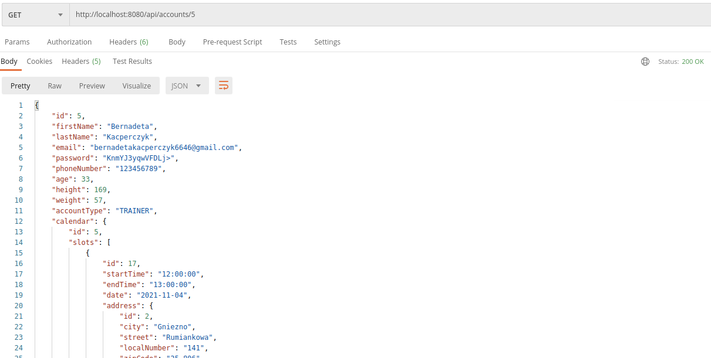
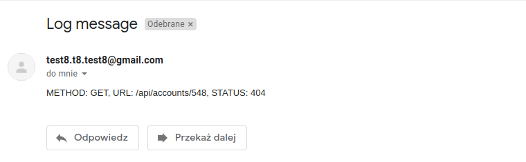
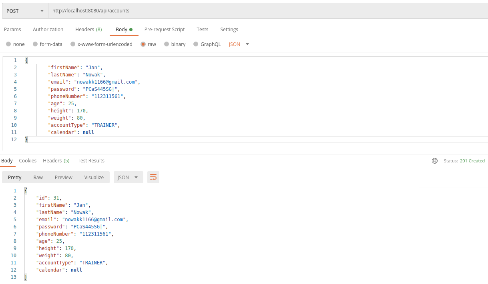

# Gymer-Rest-Api

## What is it?
***
**Gymer Rest API is an API for gym website that include standard CRUD operations. When a client makes a request to an
HTTP server (and the server successfully receives the request) API notify the client if the request was 
successfully handled or not.
Additionally, we implemented mechanism to send log errors to email if they occur during the API request.**

## Gymer in action
***
*(Examples with use of account entity)*
* ### Example GET methods
  After we enter example **http://localhost:8080/api/accounts** URL and click 'Send' we receive the response with
  200 OK status code
   
   We can specify which account we want to receive adding its id
   
   As mentioned above if we enter wrong account id (that we haven't got in a database) we receive 404 status code
   
   We receive mail with information about error on mailbox
   
  
* ### Example POST method
  After we enter example **http://localhost:8080/api/accounts** URL, put JSON file in request body, and click 'Send'
  we receive the response with 201 CREATED status code and newly created record
   
  
* ### Example PUT method
  After we enter example **http://localhost:8080/api/accounts/31** URL, put JSON file in request body, and click 'Send'
  we receive the response with 204 NO_CONTENT status code
   
   If we enter wrong id - we receive 409 CONFLICT status code (and log on e-mail)
   
  
* ### Example DELETE method
  After we enter example **http://localhost:8080/api/accounts/29** URL and click 'Send'
  we receive the response with 200 OK status code
   
## Used technologies and tools
***
* Java 15
* Spring Boot
* PostgreSQL
* JSP
* Maven
* Log4J

## How to run?
***
1. Download the repository to your machine.
2. Open project in your IDE.
3. Create application.properties file in **src/main/resources**. Copy the content of application_template.properties 
   and paste into newly created application.properties file.
4. Create your own Postgres database, populate it with **sample_data.sql** file in sql_data directory and paste 
   needed information to application.properties. 
    Enter e-mail address and password (in application.properties) of mail that you want to use to send the logs. To see logs you need to
   modify LoggerRequestInterceptor.class. In 28th line change the mail **test8.t8.test8@gmail.com** to your own 
   mail address as you don't have access to default one. If it's not working - if you're not using 2-step verification, you may need 
   to allow less secure apps to access your account.
5. Run main() method in GymerRestApiApplication.class
6. Open Postman and test endpoints
7. Fast test:
* Choose GET method and paste **http://localhost:8080/api/accounts** URL
* Click 'Send' button, and you should see the response as JSON with list of accounts

#### Project will no longer be continued as it's only for educational purposes.
